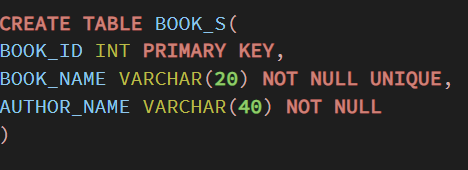
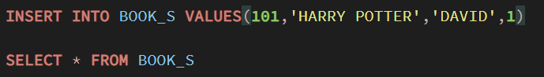
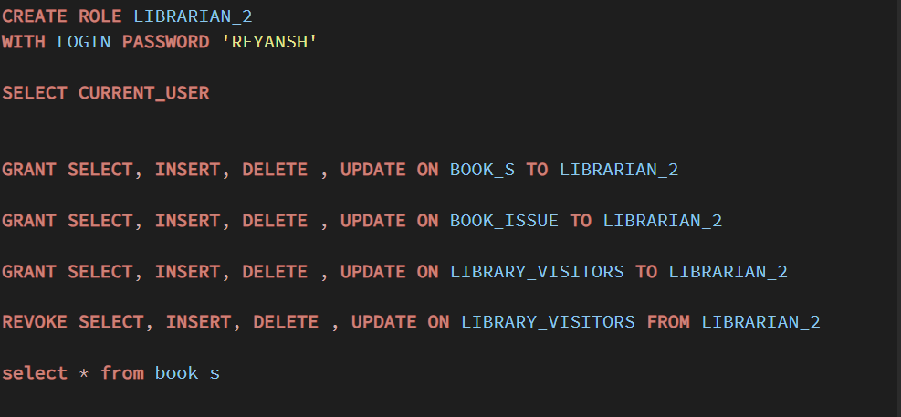
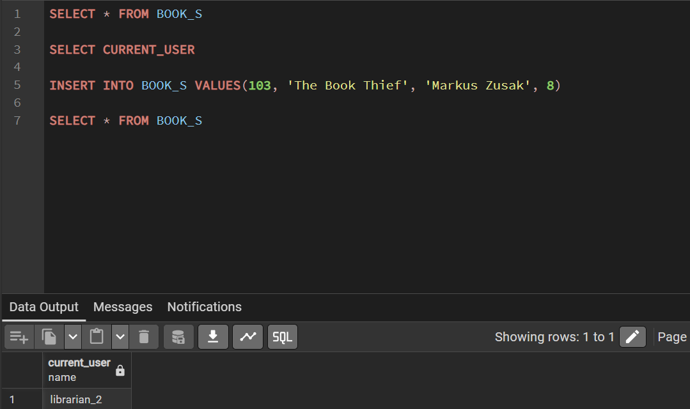

Experiment 1: Library Management System Database
Aim

To design and develop a Library Management System database by defining appropriate tables with primary keys, foreign keys, and integrity constraints, and to perform DML operations along with DCL commands such as role creation, privilege assignment, and privilege revocation to ensure controlled and secure database access.

Objectives

To acquire practical exposure to Data Definition Language (DDL), Data Manipulation Language (DML), and Data Control Language (DCL) operations in a real database setup. The experiment also focuses on implementing role-based access control to enhance data security and management.

Practical / Experiment Steps

Schema Architecture:
Designed the core database structure by creating the BOOKS and LIBRARY_VISITORS tables. Data integrity was ensured through constraints such as NOT NULL, UNIQUE, and CHECK, including an age restriction to allow visitor registration only for users aged 18 years and above.

Relational Mapping:
Created the BOOK_ISSUE table to manage transactional records, establishing relationships between books and visitors using foreign key constraints.

Data Seeding:
Inserted a set of sample records into the tables to test and validate the correctness of the schema design and table relationships.

Operational Validation:
Performed update and delete operations to examine how the database enforces constraints and maintains referential integrity during data modifications.

Access Control Management:
Implemented database security by creating a dedicated Librarian role. Access privileges were carefully assigned and controlled using GRANT and REVOKE commands.

Procedure

Logged into the database server and established a successful connection.

Created a separate database environment for the Library Management System.

Executed CREATE TABLE statements in a structured sequence, ensuring that parent tables were created before dependent tables.

Inserted multiple records into the BOOKS and LIBRARY_VISITORS tables using INSERT statements.

Executed SELECT queries involving multiple tables to verify data accuracy and relational consistency.

Performed UPDATE and DELETE operations to validate constraint enforcement during data changes.

Created the Librarian role and assigned specific privileges required for database operations.

Tested access control by executing restricted commands before and after revoking permissions.

Consolidated all SQL scripts and captured screenshots of successful executions for documentation.

I/O Analysis

1.Table Creation: BOOKS

2.Insert and Select Operations: BOOKS

3.Table Creation: LIBRARY_VISITORS

4.Table Creation: BOOK_ISSUE

5.Role Creation and Privilege Assignment

Learning Outcomes

Gained hands-on experience working with PostgreSQL using pgAdmin.

Learned to create, modify, and delete database tables using SQL.

Understood how to alter tables, view table structures, create roles, and manage privileges using GRANT and REVOKE.

Implemented primary key and foreign key constraints to maintain data integrity and enforce relationships.

Developed an understanding of role-based database security mechanisms.