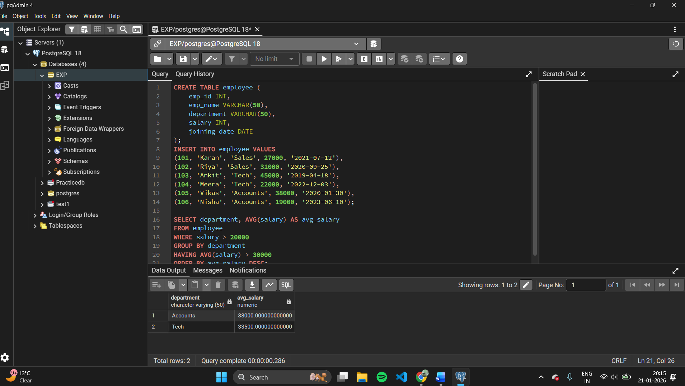

# Experiment 1.2 – Implementation of SQL SELECT Clauses

## Objective
The purpose of this experiment is to practice SQL SELECT statements and understand how different clauses like WHERE, GROUP BY, HAVING, and ORDER BY help in filtering, grouping, and sorting data.

---

## Practical / Experiment Steps
- Design an EMPLOYEE table in the database.
- Add sample employee records.
- Apply conditions to filter salary data.
- Group employees based on department.
- Calculate average salary for each department.
- Display only required departments using HAVING.
- Arrange results in descending order.

---

## Procedure of the Experiment
1. Log in to the computer system.
2. Open PostgreSQL using pgAdmin.
3. Connect to the appropriate database.
4. Create the EMPLOYEE table structure.
5. Insert sample values into the table.
6. Write the SQL query using required clauses.
7. Execute the query successfully.
8. Observe and verify the result.
9. Save the output and take screenshots.

---

## Input / Output Details

### Input
- Employee information including employee ID, name, department, salary, and joining date.
- Salary filter condition greater than 20,000.

### Output
- Average salary displayed department-wise.
- Departments having average salary more than 30,000.
- Output sorted in descending order of average salary.

---

## Learning Outcome
After performing this experiment, the student gains:
- Knowledge of SQL SELECT queries.
- Understanding of WHERE and ORDER BY clauses.
- Ability to group data using GROUP BY.
- Practical usage of HAVING clause with aggregate functions.

---

## Screenshots

