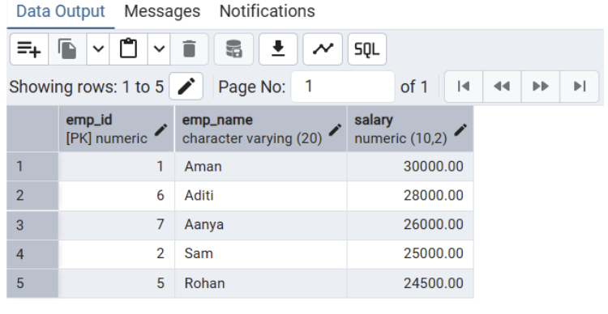
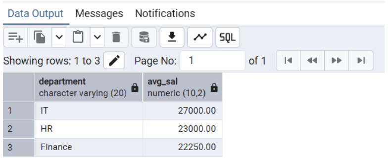
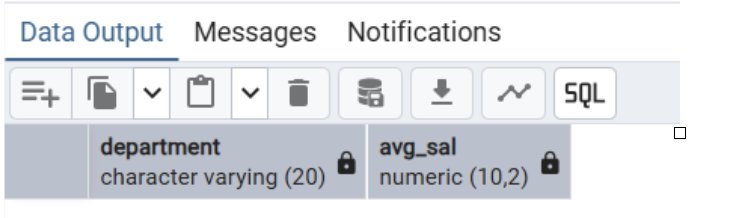

README – SQL SELECT Queries Using Clauses (Experiment 2)
1. Aim of the Session

The aim of this experiment is to study and implement SQL SELECT queries using clauses such as WHERE, GROUP BY, HAVING, and ORDER BY in order to retrieve, organize, and analyze data efficiently from relational database tables.

2. Objective of the Session

To practice writing SQL SELECT statements

To apply conditional filtering using the WHERE clause

To sort query results using the ORDER BY clause

To group records using the GROUP BY clause

To apply conditions on grouped data using the HAVING clause

To perform data analysis using aggregate functions such as COUNT(), SUM(), AVG(), MIN(), and MAX()

3. Practical / Experiment Steps

Create or utilize an existing EMPLOYEE table.

Retrieve employee records where the salary is greater than 20,000 using the WHERE clause.

Group employee records based on their department.

Compute the average salary for each department using aggregate functions.

Display only those departments where the average salary exceeds 30,000 using the HAVING clause.

Sort the final result in descending order based on the average salary.

4. Procedure of the Practical

The EMPLOYEE table is used to store employee information such as employee ID, name, department, salary, and joining date.

The WHERE clause is applied to filter employees whose salary is greater than 20,000.

The GROUP BY clause is used to organize records department-wise.

Aggregate functions are applied to calculate department-wise average salaries.

The HAVING clause is used to restrict results based on aggregate conditions.

The ORDER BY clause is used to arrange the final output in descending order of average salary.

5. I/O Analysis (Input / Output Analysis)
Input

Employee data including Employee ID, Name, Department, Salary, and Joining Date

SQL SELECT queries using WHERE, GROUP BY, HAVING, and ORDER BY clauses

Output

Department-wise average salary

Only departments with an average salary greater than 30,000

Results sorted in descending order of average salary

Screenshots

6. Learning Outcome

After completing this experiment, I was able to:

Filter records using the WHERE clause

Group records using the GROUP BY clause

Apply conditions on grouped data using the HAVING clause

Sort query results using the ORDER BY clause

Use aggregate functions to perform meaningful data analysis